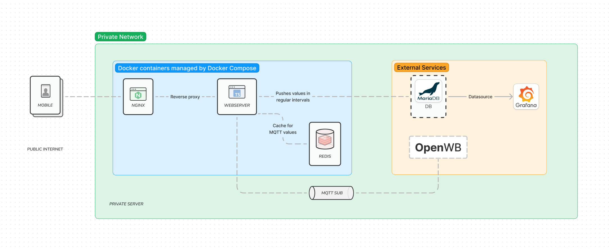
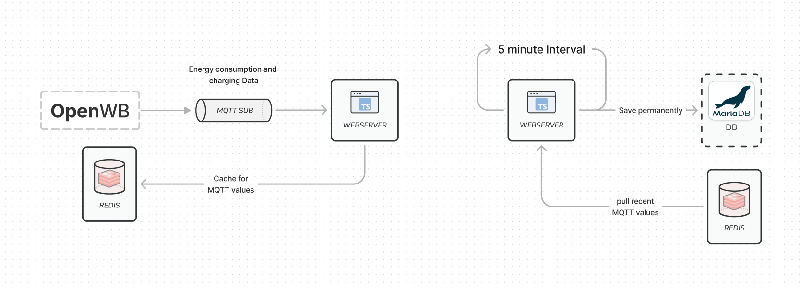

This project is aiming to build a better usable REST API for the openWB project that can be securely exposed to the public internet to then be used by mobile applications.

## Features

 - 📊 Saves charging statistics in a database
 - 📱 Exposes an easy to use JSON api that allows limited access to the wallbox from the public internet
 - 👤 Allows setting up user profiles for rfid tags which will automatically apply charging presets

## Structure

The application is split into 3 services. Firstly a nginx instance running as a reverse proxy that encrypts the traffic. Then a redis instance that is used to temporarely buffer values, and the actual web server parsing and answering request but also saving the values to an external database. There are two external services required, a OpenWB instance running in the same network, and a MariaDB instance that is used to save the values permanently.

The first and most obvious event loop is of course the webserver itself handling api requests that get forwarded by the nginx server. But besides the REST API there is another event loop, the service listens to the MQTT values published by the OpenWB and saves them on the redis instance. This is done to decouple the rest of the service from the MQTT connection. Instead of waiting for the next MQTT message the service queries all the values it needs from the redis instance which always holds the latest values for each topic. The service also saves some values to an external database in a constant interval. Again the redis instance allows this process to be decoupled from the MQTT connection, this way the time between datapoints will always stay the same.

# Future goals

### User specific features
 
 - Export individual charging log to CSV or even PDF
 - Allow more complex configurations, for example changing the SoC module

### Websocket

Some of the values need to be contantly refreshed which is currently achieved by sending GET requests in a contant interval. A websocket would be a much better solution to this problem, as the values received through the MQTT connection can be passed on to the clients which would provide a smoother experience to the users.
